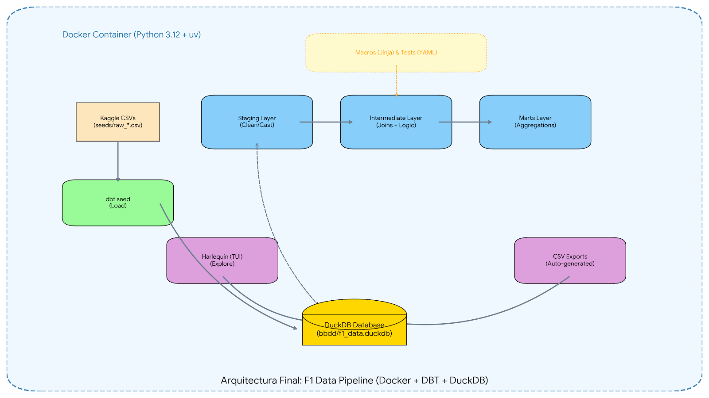

**Memoria Técnica de Ingeniería de Datos**

**F1 Telemetry Analytics Pipeline**

**Autor:** Aisha del Tio\
**Versión:** Final\
**Stack Tecnológico:** Docker · DBT Core · DuckDB · UV Package Manager · Harlequin · SQL (Jinja)

-----
**1. Introducción y Motivación**

El objetivo de este proyecto ha sido construir un pipeline de datos ELT (Extract, Load, Transform) moderno y desacoplado del sistema operativo local. Se buscó simular un entorno de producción real en el que la reproducibilidad, la calidad del dato y la automatización fueran pilares fundamentales.\
El dominio elegido ha sido la Fórmula 1, analizando datos históricos desde 1950 hasta 2024.

-----
**2. Infraestructura: Contenerización con Docker**

**2.1. El Problema de los Entornos Locales**

Aunque las instrucciones iniciales proponían el uso de entornos virtuales locales (venv), opté por migrar toda la infraestructura a Docker para garantizar que el proyecto se ejecute igual en cualquier máquina (Windows, Mac o Linux). Esto también evita la “polución” de dependencias sobre el host.

**2.2. Diseño del Dockerfile**

Se diseñó una imagen personalizada basada en python:3.12-slim.

- **Gestor de Dependencias (uv)**: Reemplacé pip por uv (Astral) para acelerar la resolución de dependencias definidas en uv.lock.
- **DuckDB CLI**: Añadí la descarga manual del binario oficial de DuckDB dentro del contenedor para permitir la ejecución nativa de consultas fuera del entorno Python.

**Comando de construcción:**

docker compose up -d --build

**2.3. Gestión de Volúmenes y Persistencia**

Al montar el volumen local ( .:/usr/app ) el directorio .venv generado durante el *build* quedaba oculto por el directorio vacío del host.

**Solución Técnica:**\
Forcé la sincronización del entorno virtual ejecutando dentro del contenedor:

uv sync --frozen

Esto permitió que tanto el contenedor como VS Code reconocieran correctamente las dependencias instaladas.

-----
**3. Inicialización y Configuración de DBT**

**3.1. Scaffolding**

Inicialicé el proyecto con:

dbt init project\_aisha

Seleccionando el adaptador **DuckDB**.\
Eliminé los modelos de ejemplo (*jaffle\_shop*) para mantener un entorno limpio.

**3.2. Arquitectura de Archivos (profiles.yml)**

Por defecto, DuckDB almacena su base de datos en la raíz del proyecto. Para mejorar el orden, actualicé el archivo configurando un subdirectorio dedicado:

path: 'bbdd/f1\_data.duckdb'

Esto separa claramente la capa de almacenamiento (storage) de la capa de lógica (código).

-----
**4. Ingesta de Datos (Capa Bronze / Seeds)**

**4.1. Estrategia de Obtención de Datos**

Intenté inicialmente consumir la API de Ergast, pero encontré inestabilidad en el servicio. Como alternativa, implementé una estrategia de *Mirroring*, descargando el dataset histórico completo (1950–2024) desde Kaggle (Community Maintained).

**4.2. Estandarización de Nomenclatura**

Renombré los 6 CSV originales (ej.: circuits.csv → raw\_circuits.csv).\
DBT genera modelos con el mismo nombre que el archivo del seed, por lo que usar el prefijo raw\_ evita colisiones con los modelos limpios.

**Carga de seeds:**

dbt seed

**Resultado:** Ingesta exitosa de más de **26.000 registros históricos** en la tabla de resultados.

-----
**5. Modelado: Arquitectura Medallion**

Implementé una arquitectura en tres capas para garantizar trazabilidad, claridad y limpieza.

**5.1. Definición de Fuentes (sources.yml)**

Documenté todas las fuentes antes de transformar los datos.

- **Calidad Preventiva:** Añadí tests de unique y not\_null sobre claves primarias como raceId y driverId, asegurando integridad antes del procesamiento.

**5.2. Capa Staging (Silver Layer)**

Capa dedicada exclusivamente a limpieza y estandarización.

- **Transformación:** Conversión de *camelCase* a *snake\_case*.
- **Casteo:** Conversión a tipos DATE o TIMESTAMP mediante try\_cast.
- **Modelos creados:**
  - stg\_f1\_drivers
  - stg\_f1\_races
  - stg\_f1\_results
  - stg\_f1\_constructors
  - stg\_f1\_circuits
  - stg\_f1\_status

En esta capa **no se realizan joins**, solo limpieza tabla a tabla.

**5.3. Ingeniería de Macros (DRY Principle)**

Desarrollé macros en Jinja para encapsular lógica compleja:

- **get\_race\_outcome.sql:**\
  Normaliza textos de resultados como *“Collision with Hamilton”* en categorías analíticas como *“Accident”* o *“Mechanical Failure”*.
- **calculate\_kpis.sql:**\
  Calcula banderas como *Victoria*, *Podio* o *Puntos*.

**5.4. Capa Intermediate**

Capa de enriquecimiento y cruces.\
Modelo principal: **int\_f1\_race\_results.sql**

- LEFT JOIN entre hechos (Resultados) y dimensiones (Pilotos, Circuitos, Status).
- **Reto Técnico:** Error de compilación (*Binder Error*).
- **Diagnóstico:** Faltaba exponer status\_id en stg\_f1\_results.
- **Solución:** Refactoricé el modelo de Staging para exponer la columna manteniendo la separación de responsabilidades.

**5.5. Capa Marts (Gold Layer)**

Generación de modelos analíticos finales:

-----
**5.5.1. f1\_season\_summary.sql (Informe de Temporada)**

- Agregación por temporada, escudería y piloto.
- **Window Functions avanzadas** (RANK() OVER PARTITION) para evaluar duelos entre compañeros de equipo.
- Cálculo de fiabilidad (% de carreras completadas sin fallo mecánico).

**5.5.2. f1\_all\_time\_stats.sql (Salón de la Fama)**

- Agregación histórica por piloto.
- Uso de string\_agg para listar equipos asociados a cada piloto.
- Cálculo de eficiencia (% de victorias sobre carreras disputadas).
- Filtrado de pilotos con baja participación para evitar ruido estadístico.
-----
**6. Testing y Aseguramiento de la Calidad (QA)**

**6.1. Integración de dbt-utils**

Añadí dbt-utils a packages.yml y ejecuté dbt deps.

- Reemplacé claves primarias manuales por dbt\_utils.generate\_surrogate\_key (hash MD5 robusto).

**6.2. Depuración de Tests**

Tras definir tests en schema.yml:

- **Problema:** Un test arrojó valores imposibles (>100%) en la métrica de fiabilidad.
- **Causa:** Uso incorrecto de SUM() sobre una granularidad que duplicaba filas.
- **Solución:** Reescritura con COUNT(DISTINCT ...) con condiciones.
- **Resultado:** **14 tests ejecutados / 14 PASS**.
-----
**7. Herramientas de Exploración y Entrega**

**7.1. Interfaz TUI (Harlequin)**

Para acelerar la exploración del modelo dentro del contenedor, añadí Harlequin (uv add harlequin).\
Permite visualizar las tablas de DuckDB desde una interfaz gráfica en la terminal.

**7.2. Automatización de Exportaciones (Hooks)**

Configuré un *post-hook* en dbt\_project.yml:

+post-hook: "COPY {{ this }} TO 'exports/{{ this.name }}.csv' (HEADER, DELIMITER ',')"

**Impacto:**\
Cada dbt run genera automáticamente los CSV finales en exports/, listos para Excel o Power BI, sin intervención manual.

**7.3. Generación de Documentación "Offline" (Single-Page Application)**

La funcionalidad nativa dbt docs generate produce múltiples archivos JSON que los navegadores modernos bloquean por seguridad (CORS) si se intentan abrir localmente sin un servidor web.

Solución Técnica Implementada: Desarrollé un script de automatización en Python (crear_static.py) ejecutado dentro del contenedor que utiliza Expresiones Regulares (Regex) para:

Analizar el código fuente minificado del index.html generado por DBT.

Inyectar dinámicamente los contenidos de manifest.json y catalog.json dentro de las variables JavaScript del HTML.

Resultado: Un único entregable portátil (index_estatico.html) que permite visualizar el linaje de datos y la documentación completa sin necesidad de instalar servidores web ni dependencias en el equipo del cliente o profesor.

-----
**8. Conclusión del Proyecto**

Se ha entregado una plataforma de datos escalable que transforma datos crudos en métricas estratégicas como Fiabilidad y Rendimiento Relativo.\
El uso de Docker aporta un entorno **Cloud Ready**, mientras que los tests automatizados garantizan que la calidad del dato sea **auditable, consistente y fiable**.

